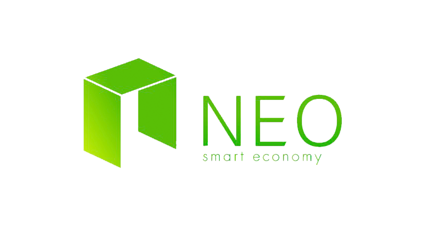
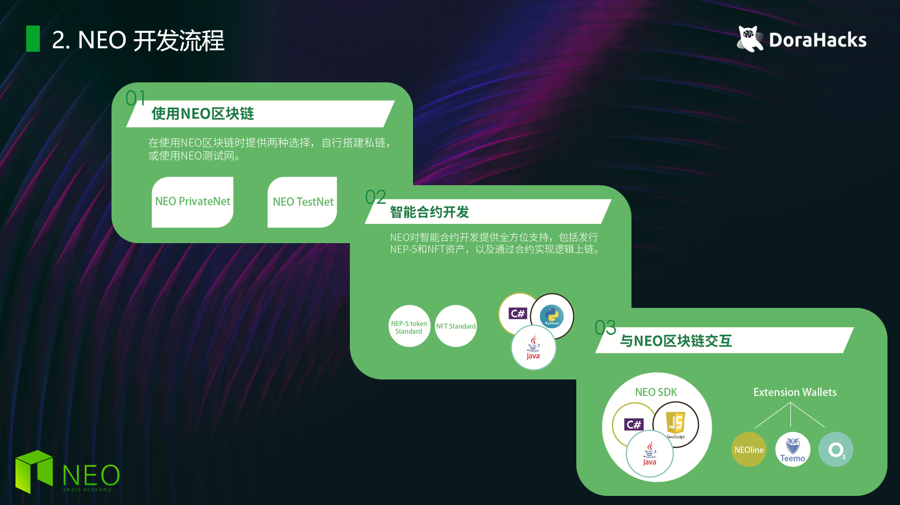

<div align="center">  

</div>

# DoraHack 第四次工业革命 - NEO分赛场
本次Dorahacks——NEO分赛场赛题开放，不论你是开发新手还是经验丰富的技术大牛都可以参加挑战。我们还在赛前设置了零基础的实践教学（workshop）；希望此次活动能够增加Dorahacks开发者们对 NEO 的关注，挖掘与培养具有潜力的NEO 社区开发者，一起为NEO开源项目做贡献。本次NEO分赛场总奖金为价值近3万元人民币的Token。

同时，获胜团队与开发者将推荐获得NEO EcoBoost的专项激励与项目扶持。NEO EcoBoost 是一个推动 NEO 生态内开发者与项目方获得扶持与激励的计划。为项目的成长提供从0-1/从1-N的帮助，匹配最合适的合作对象，实现生态内更加良性/高效/丰富的社区运转机制。


## 1. 学习参考材料

* [NEO 开发者页面](https://neo.org/dev)

* [NEO 官方技术文档](https://docs.neo.org/docs/zh-cn/index.html)

* [NEO 开发指南](https://docs.neo.org/developerguide/zh/articles/introduction.html)

* [NEO.Game 开发指南](https://github.com/neo-ngd/NEO.Game-Developer-Guide)

* [NEO 培训课程](github.com/neo-ngd/neo_training_course)

* [NEO Tutorial](github.com/neo-ngd/NEO-Tutorial)

* [数据转换工具](https://peterlinx.github.io/DataTransformationTools/)

## 2. NEO 开发流程


### **2.1 部署本地环境 – 搭建私链**
推荐：使用 `neo-local` 的 `develop` 分支：
* [neo-local - develop](https://github.com/CityOfZion/neo-local/tree/develop)

预先安装：
* Git
* [Docker](https://www.docker.com/products/docker-desktop)
 \
 **注**: Windows家庭版用户应当安装 [Docker Toolbox](https://docs.docker.com/toolbox/toolbox_install_windows/) 

 ```
 //下载neo-local代码
 git clone https://github.com/CityOfZion/neo-local.git

 //进入到neo-local的文件加下面 & 切换至 develop 分支
 cd "neo-local文件夹路径"
 git checkout develop

 //启动neo-local, 首次启动需要拉去docker镜像，可能时间比较长
 docker-compose up -d --build --remove-orphans

 //等neo-local的所有部件都启动完成以后，可以进入neo-python节点，开始和NEO私链交互
 docker exec -it neo-python /bin/bash
 np-prompt -p -v

 ```

### **2.2 区块链交互 – 使用NEO节点**
`neo-local`私链搭建好以后，可以使用其中包括的NEO节点 (`neo-python`)和其交互，可以尝试以下功能：
* 钱包功能
* 合约功能
* 查询区块链数据

关于`neo-python`的具体使用，开发者可以参考[NEO Python 小白入门](https://github.com/neo-ngd/NEO-Tutorial/blob/master/neo_docs_neopython_tutorial/neo_python_quickstart_cn.md#%E7%AC%AC%E4%BA%8C%E6%AD%A5%E9%92%B1%E5%8C%85%E6%93%8D%E4%BD%9C), 直接跳到第二节。

```
//进入neo-python以后，可以使用以下命令：

//1. 创建新的钱包 beijing.json
wallet create beijing.json
输入密码

//2. 打开预准备好的钱包 密码为: coz
wallet open neo-privnet.wallet

//3. 转账到 beijing.json 的地址
wallet send neo ***** 1000
wallet send gas ***** 1000
```

### **2.3 智能合约开发**
NEO支持多语言开发智能合约，比较完善的语言支持有：C#，python，Java

合约开发 参考文档：
* C# - [快速入门 C#](https://docs.neo.org/docs/zh-cn/sc/gettingstarted/introduction.html)
* Java - [使用 Java 编写合约](https://docs.neo.org/docs/zh-cn/sc/devenv/getting-started-java.html)
* Python - [Python合约样例](https://github.com/CityOfZion/neo-boa/tree/master/boa_test/example/demo)

合约部署 & 调用：
* 任何语言实现的合约，都需要通过编译器，编译成为avm文件。
* 通过`neo-local`内置的节点`neo-python`可以部署avm文件。
```
//此处以NEP-5合约为例, 做一下操作是需要打开钱包，并且保证有足够的GAS支付部署合约费用

//1. 首先可以先测试合约，并没有部署到私链
sc load_run /smart-contracts/nep5.avm True False False 0710 07 name []

//2. 部署合约到私链
sc deploy /smart-contracts/nep5.avm True False False 0710 07 --fee=1

//3. 初始化NEP-5
search contract beijing
sc invoke **合约Hash** deploy []

//4. 查看自己钱包有用的NEP5资产
sc invoke **合约Hash** balanceOf ['**address**']

//5. 转账 NEP5 资产
sc invoke **合约Hash** transfer ['**From Address**', '**To Address**', 100]
```

### **2.4 使用NEO-SDK & 钱包插件**
#### 1. 使用neo-SDK与区块链交互 - 私链 & 测试网
此处以 [JavaScript SDK - neon-js](http://cityofzion.io/neon-js/) 为例。
1. 如何使用，请看 [neon-js官方文档](http://cityofzion.io/neon-js/docs/en/installation.html)
2. 具体的使用例子，请看 [SDK-samples](./SDK-samples)

#### 2. 使用钱包插件与区块链交互 - 测试网
钱包插件：（具体的安装和使用说明）
1. [NEOLine](https://github.com/neo-ngd/NEO.Game-Developer-Guide/blob/master/CN/3.NEO%E9%92%B1%E5%8C%85%E6%8F%92%E4%BB%B6.md#1-neoline)
2. [Teemo](https://github.com/neo-ngd/NEO.Game-Developer-Guide/blob/master/CN/3.NEO%E9%92%B1%E5%8C%85%E6%8F%92%E4%BB%B6.md#2-teemo)


## 3. dApp demo
